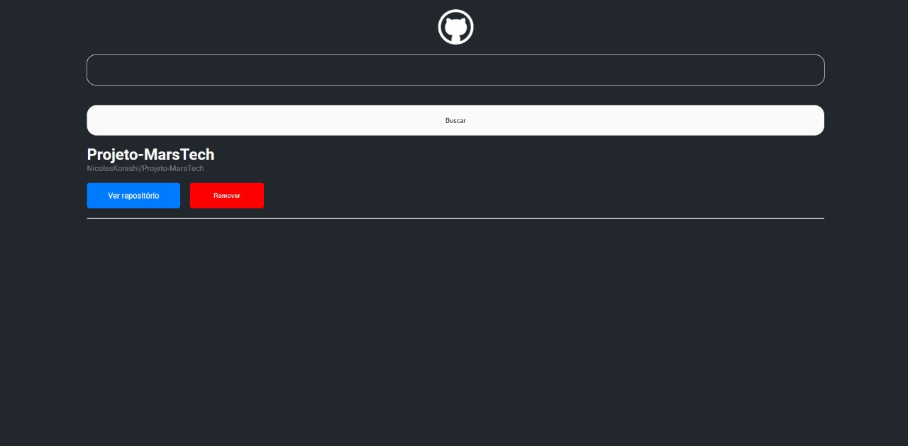

# React Wiki

Este é um projeto React que permite aos usuários buscar repositórios no GitHub usando a API do GitHub. Os repositórios encontrados são exibidos de forma interativa, permitindo que os usuários explorem detalhes sobre cada um deles.

 

## Funcionalidades

- **Busca de Repositórios:** Os usuários podem buscar repositórios pelo nome.
- **Exibição de Detalhes:** Os detalhes dos repositórios, como descrição, linguagem e número de estrelas, são exibidos.
- **Interface Intuitiva:** A interface é fácil de usar, proporcionando uma experiência agradável para o usuário.

## Tecnologias Utilizadas

- React
- Axios (para requisições à API)
- GitHub API
- CSS

